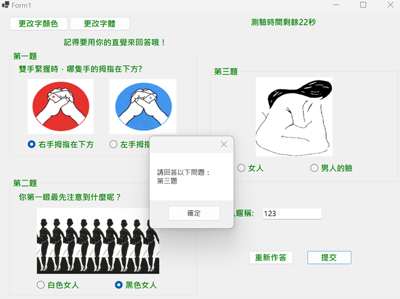

# 1121751 C# Final 程式設計專案

## 專案簡介

這是一個以 C# Windows Forms 製作的心理測驗小程式。
使用者可根據直覺回答三道圖像式問題，最後程式會根據回答結果顯示出「偏向左腦或右腦」的性格傾向。
介面提供倒數計時、題目圖片與文字選項，並可自訂字體與文字顏色，讓測驗過程更有互動性與趣味性。

---

## 專案功能與內容

- **顯示畫面**：心理測驗題目互動
共三題心理測驗，根據直覺選擇答案。題目皆搭配圖片，增強視覺吸引力。
 

- **倒數計時器**：測驗過程會顯示倒數時間，提升臨場感。


- **結果分析**：根據回答，顯示「偏向左腦或右腦」的結果與特性說明。


- **客製化設定、限制條件**：外觀自訂、可更改字型與文字顏色。
重新作答功能
可隨時重設測驗重新開始。

---

## 使用技術
- **C# Windows Forms (.NET 8.0)**：主要開發框架與視窗應用程式介面。
- **Visual Studio 2022**：開發與設計環境。
- **Windows API 元件**
- **Timer、ColorDialog、FontDialog**：控制倒數計時功能、自訂文字、顯示樣式。
- **物件導向程式設計**：透過事件驅動（Event-driven）方式實現互動邏輯。

---

## 專案執行方式

使用 Visual Studio 開啟 1121751.sln。

點擊「執行(run)」即可啟動程式。

根據畫面指示回答三個問題並送出，查看心理測驗結果。

---

## 專案結構
```
 1121751/
 ├── 1121751.sln                     # Visual Studio 解決方案
 ├── 1121751.csproj                  # 專案檔
 ├── Form1.cs                        # 主程式邏輯
 ├── Form1.Designer.cs               # 視窗設計程式碼
 ├── Form1.resx                      # 視覺資源
 ├── Program.cs                      # 主程式進入點
 ├── bin/、obj/                      # 編譯產物資料夾
 └── Properties/                     # 專案屬性與資源

```
---

## 授權說明
本專案僅供學術用途與作品展示使用。  
若需引用或修改，請標明出處。
